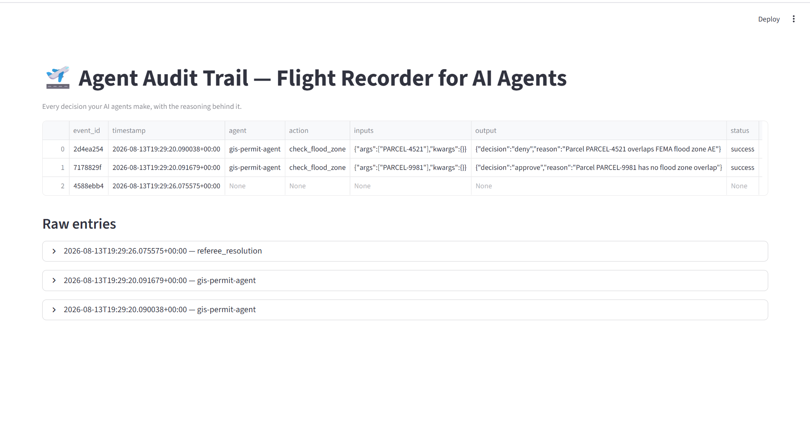

<div align="center">

# 🛫 Agent Decision Logger

### Logs every decision your AI agents make, and why, so you can trust, debug, and explain their behavior.

[](https://python.org)
[](LICENSE)


</div>

---

## Overview

AI agents are programs that make decisions automatically: approve a loan, deny an insurance claim, flag a permit. The problem is that once an AI makes a decision, nobody can easily see why it made that choice. This is a documented, real reason companies cancel AI projects: they can't explain or trust what their AI actually did.

Agent Decision Logger solves that with two small pieces:

**The Logger** silently records every decision an AI agent makes: what it was asked, what it decided, and why. Written to a permanent, readable file, similar to how an airplane's black box flight recorder writes down everything that happens so investigators can review it later.

**The Referee** steps in when two AI agents disagree with each other. It compares their reasoning and either resolves the conflict automatically or flags it for a human to review.

Both pieces are plain Python. No AI model is involved in the logging itself, it just watches and records.

---

## The demo agents in this repo

To prove this works, the repo includes two small working example agents in the `examples/` folder. You can run both yourself with no setup beyond installing one dependency.

**GIS Permit Agent** (`examples/gis_agent_demo.py`)
A simple agent that checks whether a land parcel falls inside a flood zone, and approves or denies a building permit based on that. This demonstrates the Logger capturing a real decision.

**Healthcare Claims Agents** (`examples/healthcare_agent_demo.py`)
Two separate agents look at the same insurance claim and disagree: one approves it, the other flags it as likely fraud. This demonstrates the Referee stepping in and resolving that conflict.

**How I tested these:** I wrote both demo agents myself, ran them locally, and confirmed the log file and dashboard captured every decision correctly. They use sample data I made up, not a live company system. The Logger and Referee themselves are fully real and working, just demonstrated on realistic example agents rather than a production system. Because the tool works at the function level rather than the industry level, the same integration applies to a real agent in any domain.

*(Add screenshots of your terminal running each demo here.)*

---

## What actually gets recorded

Here's the GIS agent being called:

```python
check_flood_zone("PARCEL-4521")
```

And here's the exact entry this creates in `logs/audit_log.jsonl`, the permanent record file:

```json
{
  "event_id": "2d4ea254",
  "timestamp": "2026-08-13T19:29:20.090038+00:00",
  "agent": "gis-permit-agent",
  "action": "check_flood_zone",
  "inputs": {"args": ["PARCEL-4521"], "kwargs": {}},
  "output": {"decision": "deny", "reason": "Parcel PARCEL-4521 overlaps FEMA flood zone AE"},
  "status": "success",
  "reasoning": "Parcel PARCEL-4521 overlaps FEMA flood zone AE",
  "duration_ms": 0.12
}
```

Every field here answers a specific question:
- `timestamp`: exactly when the decision happened
- `agent`: which agent made it
- `inputs`: what it was given
- `output`: what it decided
- `reasoning`: why
- `status`: whether it succeeded or errored

This line gets written automatically. No extra code inside the agent itself is needed for it to happen.

You can view this raw file directly in any text editor, or browse it visually through the included dashboard, which is just a table view of the same file:



---

## How it works under the hood

No magic here, just one Python feature called a decorator. A decorator is a small wrapper placed directly above a function using `@`. It watches that function run without touching what's inside it.

A normal AI agent function, in any industry, looks like this:

```python
def approve_loan(applicant_id):
    # their own decision logic, untouched
    return {"decision": "approve", "reason": "credit score above threshold"}
```

To plug in the logger, you add exactly two lines. Nothing else changes:

```python
from audit_trail import audit_log

@audit_log(agent_name="loan-approval-agent")
def approve_loan(applicant_id):
    # their own decision logic, untouched
    return {"decision": "approve", "reason": "credit score above threshold"}
```

That's the entire integration. It works on any Python-based agent because it doesn't care what the function does. It only watches what went in, what came out, and why.

---

## Try it yourself

```bash
# 1. Clone this repo
git clone https://github.com/SRINIVASRAVIKANTH/agent-decision-logger.git
cd agent-decision-logger

# 2. Install the dependencies
pip install -r requirements.txt

# 3. Run the GIS demo agent
python examples/gis_agent_demo.py

# 4. Run the healthcare demo
python examples/healthcare_agent_demo.py

# 5. See it all in the dashboard
streamlit run dashboard/app.py
```

After steps 3 and 4, you can also open `logs/audit_log.jsonl` directly in any text editor and see the recorded decisions yourself.

---

## What's in this repo

```
agent-decision-logger/
├── audit_trail/          the actual tool: the Logger and the Referee
│   ├── logger.py
│   └── referee.py
├── examples/              the two working demo agents
├── dashboard/             optional visual viewer for the logs
├── logs/                  where recorded decisions get written
└── README.md
```

---

## Why I built this

I work as a GeoAI Automation Engineer, and I kept running into the same issue across projects: AI agents make decisions, but nobody can easily see why, and when two agents disagree there's no clean way to resolve it. This is my attempt at solving that specific trust gap with something small, real, and reusable.

## License

MIT, see [LICENSE](LICENSE). Free to use, modify, and build on.
